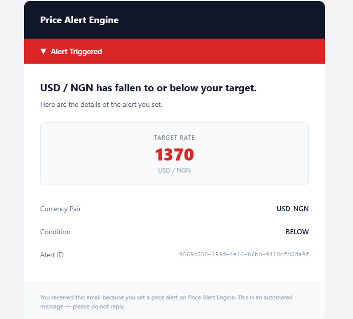
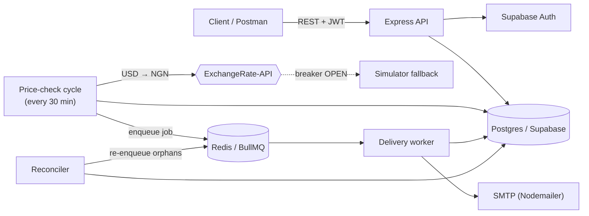
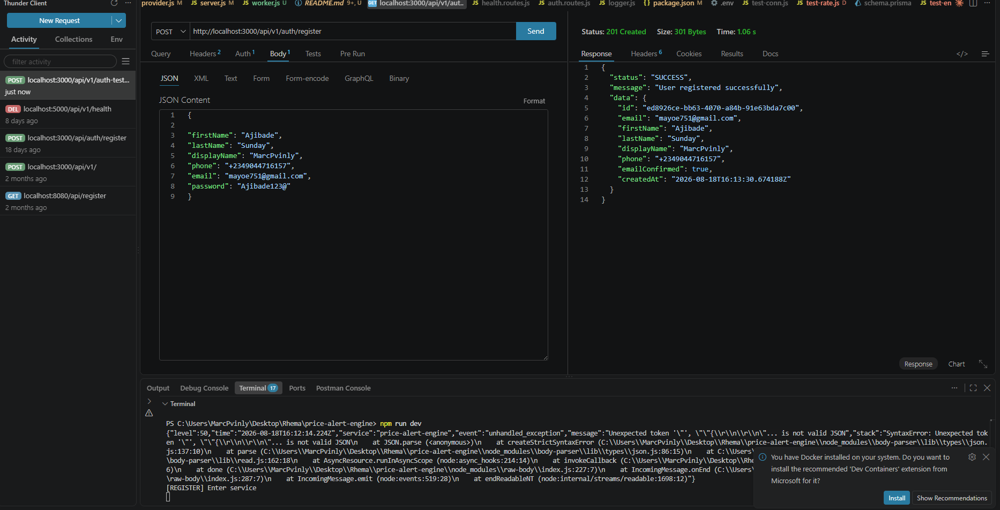
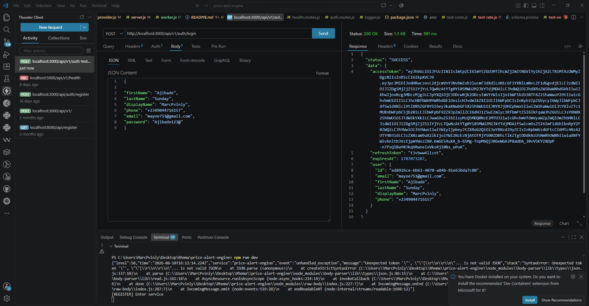
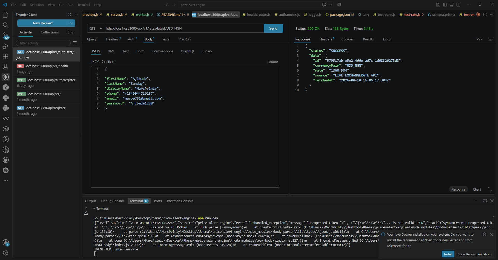
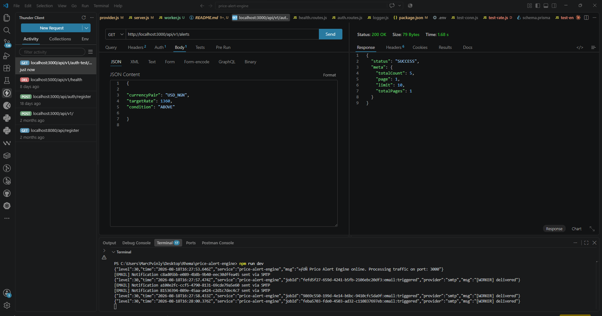

# Price Alert Engine

A backend service that watches foreign‑exchange rates (USD → NGN) and notifies users
by email/SMS the moment their target rate is hit. It is built for **reliability under
failure**: the live rate provider sits behind a circuit breaker, Postgres is the source
of truth, and delivery runs through a durable queue so a crash never loses a
notification.

---

## How it works
| `image /alerts-image` |  |


1. A scheduled **price-check cycle** fetches the USD→NGN rate, snapshots it to Postgres,
   and evaluates every `PENDING` alert.
2. Matching alerts are claimed in a single DB transaction and an **outbox row** is
   written — *then* a delivery job is enqueued (DB commit first, so nothing is lost if
   the enqueue fails).
3. A **BullMQ worker** delivers each notification and records the outcome. A
   **reconciler** sweeps for orphaned rows and re-enqueues them.

**Why these choices**

| Decision | Reason |
| --- | --- |
| Circuit breaker (`opossum`) on the FX call | An external API outage can't stall the cycle; it fails fast and falls back to a simulator. |
| Postgres = source of truth, Redis = transport | State survives a Redis flush or worker crash; the queue only moves work, it never *owns* it. |
| Transactional outbox (commit → then enqueue) | A notification is never enqueued without being persisted, and never lost if the enqueue throws. |
| Reconciler | Catches anything the outbox missed (e.g. process died between commit and enqueue). |

---

## Tech stack

**Node.js (ESM) · Express 5 · Prisma 7 · PostgreSQL (Supabase) · Supabase Auth (JWT) ·
BullMQ + Redis · opossum · Nodemailer · Twilio · Zod · Pino**

---

## API endpoints

Base URL: `http://localhost:3000`

| Method | Path | Auth | Description |
| --- | --- | --- | --- |
| `POST` | `/api/v1/auth/register` | – | Register a new user |
| `POST` | `/api/v1/auth/login` | – | Log in; returns access + refresh tokens |
| `GET` | `/api/v1/auth-test` | Bearer | Verify a token and echo the identity |
| `POST` | `/api/v1/alerts` | Bearer | Create a price alert |
| `GET` | `/api/v1/alerts` | Bearer | List your alerts (`?page=&limit=`) |
| `DELETE` | `/api/v1/alerts/:id` | Bearer | Delete one of your alerts |
| `GET` | `/api/v1/rates/latest/:currencyPair` | – | Latest stored rate, e.g. `USD_NGN` |
| `GET` | `/api/v1/health` | – | DB health (pooled + direct connections) |

Protected routes expect an `Authorization: Bearer <accessToken>` header (get the token
from `/auth/login`).

<details>
<summary>Example request bodies</summary>

**Register**
```json
{
  "firstName": "Ada",
  "lastName": "Lovelace",
  "displayName": "ada",
  "phone": "+2348012345678",
  "email": "ada@example.com",
  "password": "Str0ng@Pass1"
}
```

**Login**
```json
{ "email": "ada@example.com", "password": "Str0ng@Pass1" }
```

**Create alert**
```json
{ "currencyPair": "USD_NGN", "targetRate": 1600, "condition": "ABOVE" }
```
</details>

---

## Screenshots (Postman)

> Drop your Postman screenshots into `docs/screenshots/` using the file names below and
> they'll render here automatically.

| Endpoint | Screenshot |
| --- | --- |
| `POST /auth/register` |  |
| `POST /auth/login` |  |
| `POST /alerts` |  |
| `GET /alerts` |  |
| `DELETE /alerts/:id` |  |
| `GET /rates/latest/:pair` |  |
| `GET /health` |  |


---

## Getting started

### Prerequisites
- Node.js 18+
- A PostgreSQL database (Supabase project)
- A reachable Redis instance (for BullMQ)
- An [ExchangeRate-API](https://www.exchangerate-api.com) key (free tier)

### Setup
```bash
# 1. Install dependencies
npm install

# 2. Configure environment
cp .env.example .env      # then fill in real values

# 3. Apply the database schema
npx prisma migrate deploy
npx prisma generate

# 4. Run (API + price cycle + in-process worker + reconciler)
npm run dev
```

Run the delivery worker as its own process instead (set `RUN_WORKER_IN_PROCESS=false`):
```bash
npm run worker        # or: npm run dev:worker  (with reload)
```

### Environment variables
Every variable is documented inline in [`.env.example`](.env.example). Key ones:

| Variable | Purpose |
| --- | --- |
| `DATABASE_URL` | Postgres transaction pooler (port 6543) — runtime queries |
| `DIRECT_URL` | Direct Postgres connection (port 5432) — migrations |
| `SUPABASE_*` | Supabase auth (JWT verification) |
| `EXCHANGERATE_API_KEY` | Live FX rate provider |
| `REDIS_URL` | BullMQ transport |
| `SMTP_*` / `MAIL_FROM` | Email delivery via Nodemailer |
| `PRICE_CHECK_INTERVAL_MS` | Rate-check cadence (defaults to 30 min) |

---

## Project structure

```
src/
├─ server.js            # API entrypoint: HTTP + price cycle + optional worker
├─ worker.js            # Standalone delivery worker entrypoint
├─ app.js               # Express app & route wiring
├─ routes/              # health, auth, alerts, rates
├─ controllers/         # request/response handlers
├─ services/            # business logic (alerts, rates, trigger, delivery)
├─ providers/           # fx, email, log integrations (+ circuit breaker)
├─ scheduler/           # price-alert cycle
├─ queues/              # BullMQ queue + reconciler
├─ workers/             # notification worker
├─ middleware/          # auth (Supabase JWT), error handling
├─ validators/          # Zod schemas
└─ config/              # database, redis, supabase
```

---

## License

ISC
